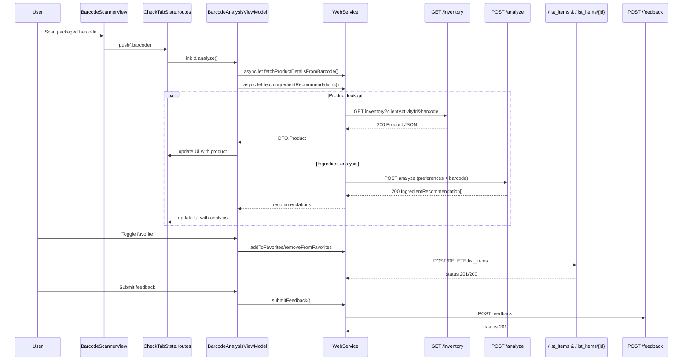
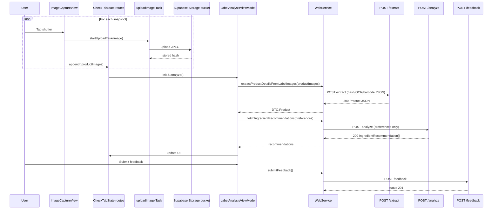

# Backend Call Sequence Diagrams

## Barcode Scan to Analysis

## Label Photo Capture to Analysis

## Supporting Flows

- History & Favorites tabs refresh with `fetchHistory` (GET `/history[?searchText]`) and `getFavorites` (GET `/list_items/{defaultList}`); thumbnails fetch images via Supabase storage URLs when needed.
- Dietary preferences use `addOrEditDietaryPreference`, `deleteDietaryPreference`, `uploadGrandFatheredPreferences`, and `getDietaryPreferences`.
- Account deletion calls `deleteUserAccount`; clearing captured photos runs `deleteImages` to remove uploaded files.
